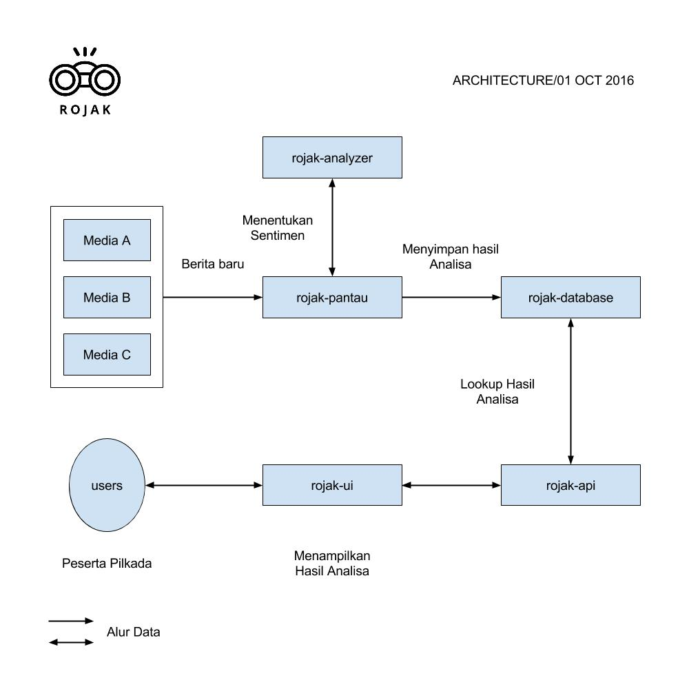

# Project Rojak

Project Rojak adalah sebuah **non-profit** project untuk membantu
jalannya Pilkada DKI Jakarta 2017 dalam hal pengawasan media daring.

Dengan bantuan Rojak kita bisa tau media mana saja yang pro/kontra
pasangan cagub-cawagub, bagaimana trend politik Pilkada DKI 2017 di
Indonesia dari hari ke hari berdasarkan data seluruh media daring di
Indonesia, pasangan cagub-cawagub mana yang paling banyak di bahas
oleh media dan lain-lain.

Project ini untuk masyarakat Indonesia, khususnya warga Jakarta, jadi
semua hasil dari project ini akan di rilis di publik agar semua orang
bisa mengakses.

Di dokumen ini berisi latar belakang masalah yang mau diselesaikan,
tujuan, gambaran umum dan bagaimana kalian bisa berkontribusi di
Project Rojak.

## Latar Belakang

Sebelum memantapkan pilihan nya, hal pertama yang di lakukan oleh para
peserta Pilkada DKI 2017 adalah mencari tau informasi tentang pasangan
cagub-cawagub di media daring Indonesia. Sayangnya, **tidak ada** media
yang memberikan pandangan objektif/netral kepada pasangan cagub-cawagub
yang akan bertanding. Hal ini lah yang akan mempengaruhi pandangan
peserta pilkada terhadap masing-masing pasangan cagub-cawagub.

Salah satu dampak dari hal ini adalah para pembaca media di Indonesia
membenci pasangan calon cagub-cawagub tertentu karena telah membaca
berita negatif tentang pasangan tersebut. Padahal media yang menerbitkan
berita negatif tersebut memberitakan hal-hal negatif karena mendukung
pasangan cagub-cawagub yang lain.

*Dengan kita tau media yang kita baca mendukung pasangan cagub-cawagub
mana/condong ke pasangan yang mana, kita bisa menjadi pembaca yang bijak
dan tidak mudah terprovokasi*.

## Tujuan

1. Memberikan pandangan objektif ke semua pasangan Cagub-Cawagub DKI Jakarta
2. Membantu peserta pilkada untuk menjadi peserta yang bijak, tidak
   terprovokasi dan tidak terpengaruh media bayaran.

## Gambaran Umum

Pada bagian ini akan di jelaskan gambaran umum project Rojak. Pada dasarnya
Rojak di bangun dari komponen-komponen yang mempunyai fungsi masing-masing dan
saling terhubung. Berikut diagram yang menggambarkan komponen apa saja yang
membangun Rojak beserta interaksinya:

Masing-masing tugas utama komponen:

* *rojak-pantau*: Memantau seluruh media daring di Indonesia
* *rojak-analyzer*: Menentukan sentimen suatu berita
* *rojak-database*: Menyimpan hasil analisa
* *rojak-api*: Memberikan akses dari public ke *rojak-database*
* *rojak-ui*: Menampilkan hasil analisa dari Rojak

Salah satu komponen terpenting adalah *rojak-ui*, komponen ini adalah
abstraksi yang berinteraksi langsung dengan peserta Pilkada. *rojak-ui*
bisa berupa web-based, apps sampai Facebook Bot dan lain-lain.

## Mari Berkontribusi!

Tantangan terbesar pertama adalah bagaimana kita bisa menyampaikan hasil
analisa Rojak kepada para peserta Pilkada DKI 2017. Ide-ide kreatif dan
hasil karya dari kawan-kawan sangatlah di perlukan.

Beberapa inisiatif yang akan di lakukan untuk menyelesaikan tantangan ini
adalah:

* Web-based interface ala [libscore](https://libscore.com) oleh
  [Donny](https://www.facebook.com/DonnyStaark)
* Facebook Bot a.k.a "Relawan Rojak" oleh [Rio](https://www.facebook.com/riordhn)
* Android apps oleh [Vicky](https://www.facebook.com/vickyvernandodasta)

Dan masih banyak yang bisa kita eksplor lagi.

Tantangan terbesar kedua adalah bagaimana kita membuat system yang bisa
mengawasi seluruh media daring di Indonesia dan menganalisa setiap berita
yang diterbitkan.

Untuk berkontribusi langsung atau sekedar bertanya tentang komponen-komponen
Rojak bisa menghubungi [Bayu](https://www.facebook.com/bayualdiyansyah)

## Progress

Progress akan di update oleh PIC masing-masing:

* rojak-pantau: **In Progress**, PIC: Bayu
* rojak-analyzer: **In Progress**, PIC: Bayu
* rojak-database: **In Progress**, PIC: Bayu
* rojak-api: **In Progress**, PIC: -
* rojak-ui-web: **In Progress**, PIC: Dony
* rojak-ui-bot: **In Progress**, PIC: Rio
* rojak-ui-app: **In Progress**, PIC: Vicky

## Contributors

In alphabetical order:

* [Bayu Aldi Yansyah](https://www.facebook.com/bayualdiyansyah)
* [Donny Stark](https://www.facebook.com/DonnyStaark)
* [Rio Ramadhan Dharmawan](https://www.facebook.com/riordhn)
* [Rahmat Iqbal Rizaldi Pratama](https://www.facebook.com/rahmat.iqbal13)
* [Vicky Vernando Dasta](https://www.facebook.com/vickyvernandodasta)
* Kamu!! (Silahkan kontak salah satu dari kami)

Semua berkontribusi secara sama.

## License

BSD 3-Clause
